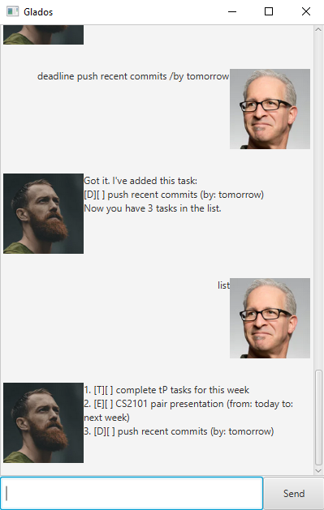

# Glados User Guide



Glados is a desktop task tracker that will manage your todos, events and deadlines for you. 

## Adding todos, deadlines and events

Todos are tasks without any start or end date. 

Deadlines are tasks with a deadline.

Events are tasks with a start and end date. 

Example: `event CS2101 pair presentation /from today /to next week`

```
Got it. I've added this task:
[E][ ] CS2101 pair presentation (from: today to: next week)
```

## Tracking tasks

Glados helps you track all these tasks. 

To view all tasks, simply type `list`

To search tasks by keyword, simply type `find (query)`

To delete a task, simply type `delete (task number)`

Example: `find CS2101`

```
1. [E][ ] CS2101 pair presentation (from: today to: next week)
```

## Save tasks locally

Glados autosaves all of your tasks locally, and loads them up everytime you open Glados. 

## Help

To get the syntax of all commands, type `help`. 